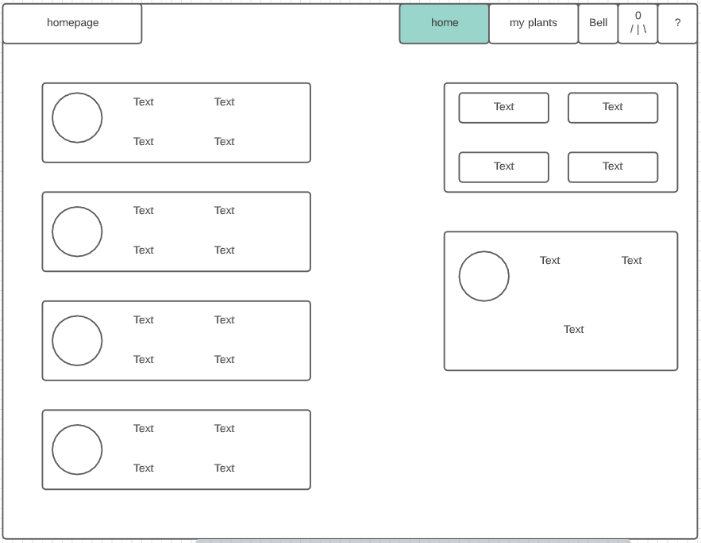

# My UX Projects - *homegrown*

### The Purpose
Life is busy and plants suffer when forgotten, so *homegrown* provides that necessary reminder when our green friends need a little care and attention. 

## Brainstorming
I tried to come up with other ideas but the only ones that really sparked interest were to do with plants so I figured out what the hardest thing for me to remember about owning plants is and came up with *homegrown* as a result.

## Discovery Phases
After coming up with a basic idea and getting user feedback on that idea, I started sketching out the ideas in my head about my website, each sketch realizing more of what I wanted *homegrown* to look like. Here are a few examples: 
 

 

## Mind Map
After completing sketches for every page I thought the website needed, I created a mind map to delve into what I wanted users to feel when using *homegrown*
 
I also designed a color pallete that I thought matched well with the feeling of the site, and what it was meant to accomplish.

## Wireframes
Before creating my prototype, I wrote an enormous planning document and went through each sketch to write down pages I needed as well as any extra pages I thought of. After I was satisfied with that, I created wireframes for each page. 

## High-Functioning Prototype
After finishing the wireframes, I moved on to creating a high-functioning prototype in Adobe XD. This allowed me to concretely visualize the website without having to reorganize and edit code each time I wanted to make a big change. Below is how I organized all the different pages that were connected through Adobe XD's prototyping tools.

If you'd like, you can [view the *homegrown* prototype](https://xd.adobe.com/view/6884cace-8c66-40e2-8536-6d7d4b3b6d60-3dd7/?fullscreen) here

## User Testing
Now that I had a working prototype, I sent the prototype to potential users and got their feedback. This was my favorite part of the process as I got to see others interact with what I'd worked so hard on. I enjoyed hearing what they liked, what they didn't, and suggestions for different features the site could have. 
Overall, their opinions of *homegrown* were positive, which I was very glad of.

## Usability Heuristics
The Usability Heuristics were interesting to learn and work with while creating this project. Here is how I implemented the following heuristics: 
1. Match between system and real world - I used icons and text that users would be familiar with so that they wouldn't have to spend too long learning how to use the app. Like on my my plants page, I used a + for adding a plant and a magnifying glass to identify a plant. Users are familiar with these symbols so it will make using that interface easier.
2. User Control and Freedom - my prototype depends entirely on the user telling it what to do and allows all possible freedoms to allow users control over their plants and their account.
3. Consistency and Standard - I used the same styles and colors across my entire website. I created a color scheme to make sure I used the same colors on every page, along with basic shapes and ideas that are present across the site.
4. Error Prevention - I implemented verification steps so that if ever a user is taking an action that's in the danger zone of deleting something like a plant, they will have to double check before the action goes through.
5. Recognition rather than recall - I laid out my site in a way that is familiar to users so that they could find their way around the site pretty intuitively.
6. Flexibility and Efficiency of use - all elements are easily accessible by users with very few convoluted steps so they get to their goal as quickly as possible.
7. Aesthetic and Minimalist design - I stuck to my chosen color palette so that each page matches the overall aesthetic of the site. I also reduced the amount of objects on screen at one time so the user only sees the most important items for that page.
8. Error Recovery - Just as I introduced verification steps in no. 5, so did I create ideas for error handling to help the user get to their desired destination.
9. Help and Documentation - I created a help page for users to look through if they have any questions as well as creating a form so that users can directly contact the support team.
10. Visibility of System Status - while pages load, I would display a little animatic of a plant growing that is synchronized with the progress of the system loading. 

## Moving Forward
This project is by no means finished yet and I am excited to continue developing it. This project was one of the highlights of my semester and I was thrilled to hear from the users testing it that they would like to use it beyond just a prototype. 
