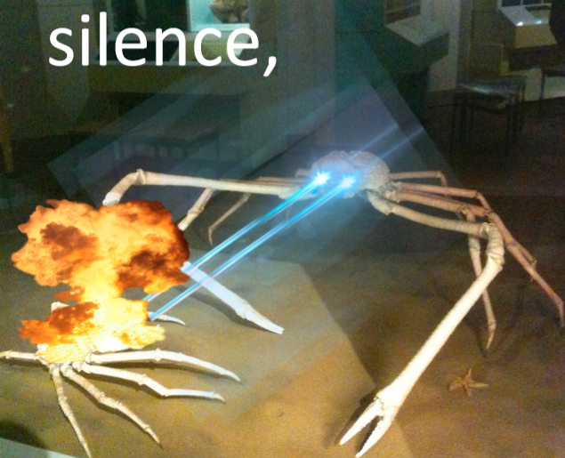

## Thanks for visiting my portfolio! - Aurora Kehoe

### About Me
I'm Aurora Kehoe and I grew up in the mountains in the middle of a very beautiful nowhere. I grew up reading books in various corners around the house or gamboling about the foothills near my house without much access to the internet or video games. I realized that I had an affinity for computers once I got a laptop for high school. I took a coding class in my last year of high school and that started me on a journey that I continue to explore now. Growing up in a family that held art in a place of high importance has helped me view my code and projects I contribute to with a discerning eye that aids in making it cleaner and friendlier to those who use it after me. 

### Skills and Experience
**Skills**: Java, C#, Selenium, JavaScript, Cypress, Microsoft Office, Adobe Creative Cloud

**Experience** Coming up on 2 years in creating and maintaining automated testing environments for contracted sites as well as a time being a project manager for a full-class collaborative project.

### Things I've Done
I have had the opportunity to work on several projects that I enjoyed. You can [view my projects](projects.md) here.
