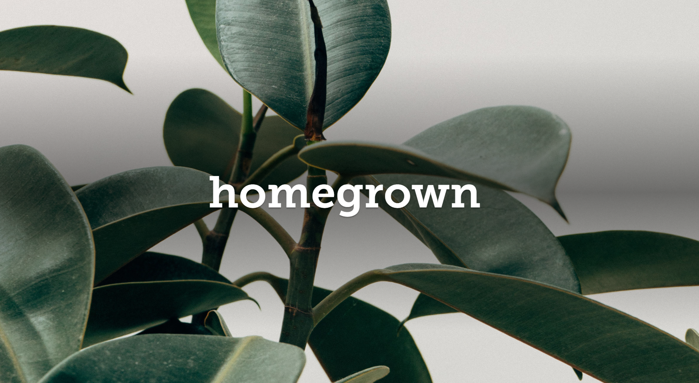

### My UX Projects

I am excited to show my projects that I've completed over the years. Please enjoy. 

[*homegrown*](homegrown.md) - A project for my UX Design course in Fall 2020 based on notifying users when their houseplants are in need of attention and care. I'm very fond of this project and I intend to develop it further. Here is where the project stands thus far. 

[*The Great Purge*](testEnvironment.md) - This project doesn't really have a name, but it's one of the things I am most proud of during my two-year internship. Basically, my fellow intern and I defeated a leviathan of a project during the first summer of our internship and were able to clean up a test environment, creating a much-improved project for us and for all future interns who need to interact with that code. 

[Photo by Christina Morillo from Pexels](https://www.pexels.com/photo/black-and-gray-laptop-computer-turned-on-doing-computer-codes-1181271/)
